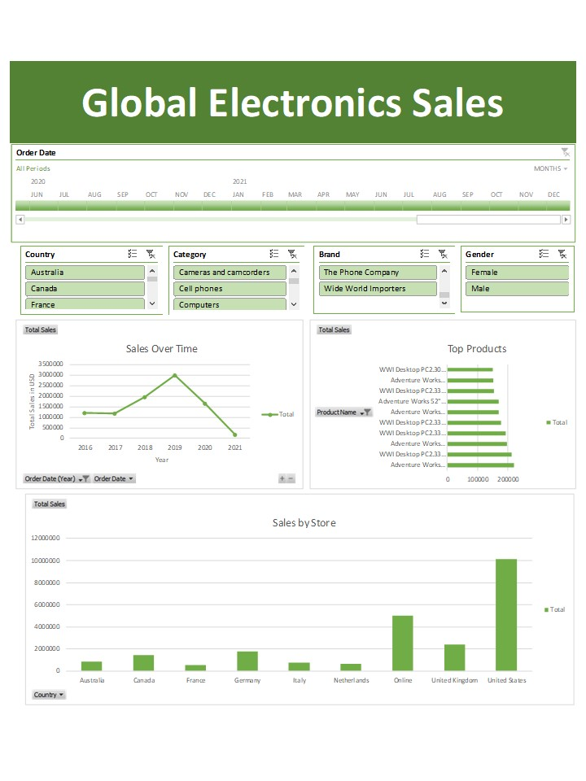

# Global-Electronics-Sales-Analysis
An end-to-end data analysis project using Excel, Power Query, and Pivot Tables.

## Project Overview
This project analyzes global sales data to understand customer purchasing behavior and product performance.

**Goal:** To transform raw CSV data into an interactive dashboard that tracks revenue, regional trends, and product popularity.

## Tools Used
* **Excel:** The main platform for analysis.
* **Power Query:** Used to clean the data, remove duplicates, and standardize currency formats.
* **Pivot Tables:** Used to summarize the data.
* **Data Visualization:** Created charts and slicers for the dashboard.

## The Process
1. **Data Collection:** Imported raw CSV files containing global transaction records.
2. **Data Cleaning:** - Checked for missing values.
   - Converted data types (Dates, Currency).
   - You can view the specific cleaning steps I used in the file `cleaning-steps.txt`.
3. **Analysis:** - Built a data model to connect sales data with location and product data.
   - Calculated Total Sales and Year-over-Year growth.

## Conclusion
This project demonstrates how raw data can be transformed into actionable business insights using Excel's advanced features.
